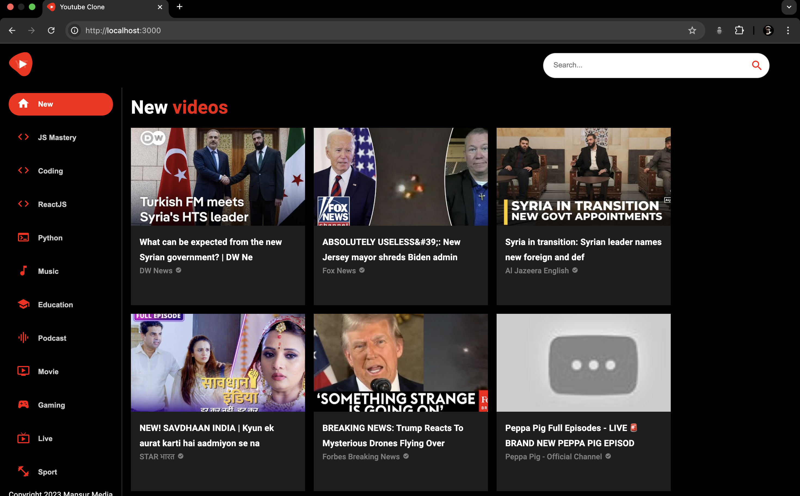

# A Modern YouTube Clone Application in React JS with Material UI 5 and RapidAPI

For clone to work, get API key from https://rapidapi.com/ytdlfree/api/youtube-v31  
Put it in environment variable `REACT_APP_RAPID_API_KEY`
